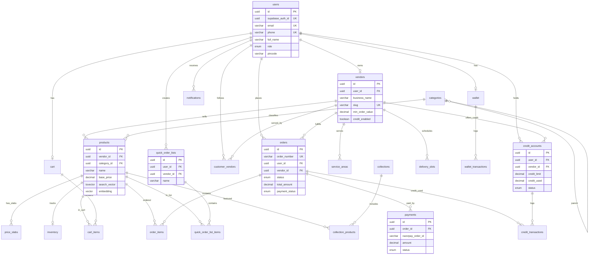

# Horeca1 — Part 4: Machine-Readable Artifacts (Deliverable B)

## B.1 — Prisma Schema

```prisma
generator client {
  provider        = "prisma-client-js"
  previewFeatures = ["postgresqlExtensions"]
}

datasource db {
  provider   = "postgresql"
  url        = env("DATABASE_URL")
  extensions = [pgvector, pg_trgm]
}

// ─── AUTH ─────────────────────────────────────────────
model User {
  id              String   @id @default(uuid()) @db.Uuid
  supabaseAuthId  String   @unique @map("supabase_auth_id") @db.Uuid
  email           String   @unique @db.VarChar(255)
  phone           String?  @unique @db.VarChar(20)
  fullName        String   @map("full_name") @db.VarChar(255)
  role            Role     @default(customer)
  pincode         String?  @db.VarChar(10)
  businessName    String?  @map("business_name") @db.VarChar(255)
  gstNumber       String?  @map("gst_number") @db.VarChar(20)
  isActive        Boolean  @default(true) @map("is_active")
  createdAt       DateTime @default(now()) @map("created_at") @db.Timestamptz
  updatedAt       DateTime @default(now()) @updatedAt @map("updated_at") @db.Timestamptz

  vendor           Vendor?
  cart             Cart?
  wallet           Wallet?
  orders           Order[]
  quickOrderLists  QuickOrderList[]
  customerVendors  CustomerVendor[]
  creditAccounts   CreditAccount[]
  notifications    Notification[]

  @@map("users")
}

enum Role {
  customer
  vendor
  admin
}

// ─── VENDOR ───────────────────────────────────────────
model Vendor {
  id             String   @id @default(uuid()) @db.Uuid
  userId         String   @unique @map("user_id") @db.Uuid
  businessName   String   @map("business_name") @db.VarChar(255)
  slug           String   @unique @db.VarChar(255)
  description    String?  @db.Text
  logoUrl        String?  @map("logo_url") @db.VarChar(512)
  bannerUrl      String?  @map("banner_url") @db.VarChar(512)
  rating         Decimal  @default(0) @db.Decimal(2, 1)
  minOrderValue  Decimal  @default(0) @map("min_order_value") @db.Decimal(10, 2)
  creditEnabled  Boolean  @default(false) @map("credit_enabled")
  isActive       Boolean  @default(true) @map("is_active")
  isVerified     Boolean  @default(false) @map("is_verified")
  createdAt      DateTime @default(now()) @map("created_at") @db.Timestamptz
  updatedAt      DateTime @default(now()) @updatedAt @map("updated_at") @db.Timestamptz

  user             User               @relation(fields: [userId], references: [id])
  serviceAreas     ServiceArea[]
  products         Product[]
  priceSlabs       PriceSlab[]
  inventory        Inventory[]
  deliverySlots    DeliverySlot[]
  orders           Order[]
  cartItems        CartItem[]
  quickOrderLists  QuickOrderList[]
  quickOrderItems  QuickOrderListItem[]
  payments         Payment[]
  creditAccounts   CreditAccount[]
  creditTxns       CreditTransaction[]
  customerVendors  CustomerVendor[]
  collectionProducts CollectionProduct[]

  @@map("vendors")
}

model ServiceArea {
  id        String   @id @default(uuid()) @db.Uuid
  vendorId  String   @map("vendor_id") @db.Uuid
  pincode   String   @db.VarChar(10)
  isActive  Boolean  @default(true) @map("is_active")
  createdAt DateTime @default(now()) @map("created_at") @db.Timestamptz

  vendor Vendor @relation(fields: [vendorId], references: [id], onDelete: Cascade)

  @@unique([vendorId, pincode])
  @@index([pincode])
  @@map("service_areas")
}

model DeliverySlot {
  id         String  @id @default(uuid()) @db.Uuid
  vendorId   String  @map("vendor_id") @db.Uuid
  dayOfWeek  Int     @map("day_of_week")
  slotStart  String  @map("slot_start") @db.VarChar(10)
  slotEnd    String  @map("slot_end") @db.VarChar(10)
  cutoffTime String  @map("cutoff_time") @db.VarChar(10)
  isActive   Boolean @default(true) @map("is_active")

  vendor Vendor  @relation(fields: [vendorId], references: [id], onDelete: Cascade)
  orders Order[]

  @@unique([vendorId, dayOfWeek, slotStart])
  @@map("delivery_slots")
}

model CustomerVendor {
  id            String    @id @default(uuid()) @db.Uuid
  userId        String    @map("user_id") @db.Uuid
  vendorId      String    @map("vendor_id") @db.Uuid
  isFavorite    Boolean   @default(false) @map("is_favorite")
  lastOrderedAt DateTime? @map("last_ordered_at") @db.Timestamptz
  createdAt     DateTime  @default(now()) @map("created_at") @db.Timestamptz

  user   User   @relation(fields: [userId], references: [id], onDelete: Cascade)
  vendor Vendor @relation(fields: [vendorId], references: [id], onDelete: Cascade)

  @@unique([userId, vendorId])
  @@map("customer_vendors")
}

// ─── CATALOG ──────────────────────────────────────────
model Category {
  id        String     @id @default(uuid()) @db.Uuid
  name      String     @db.VarChar(255)
  slug      String     @unique @db.VarChar(255)
  parentId  String?    @map("parent_id") @db.Uuid
  imageUrl  String?    @map("image_url") @db.VarChar(512)
  sortOrder Int        @default(0) @map("sort_order")
  isActive  Boolean    @default(true) @map("is_active")
  createdAt DateTime   @default(now()) @map("created_at") @db.Timestamptz

  parent   Category?  @relation("CategoryTree", fields: [parentId], references: [id])
  children Category[] @relation("CategoryTree")
  products Product[]

  @@map("categories")
}

model Product {
  id             String                 @id @default(uuid()) @db.Uuid
  vendorId       String                 @map("vendor_id") @db.Uuid
  categoryId     String?                @map("category_id") @db.Uuid
  name           String                 @db.VarChar(255)
  slug           String                 @db.VarChar(255)
  description    String?                @db.Text
  imageUrl       String?                @map("image_url") @db.VarChar(512)
  packSize       String?                @map("pack_size") @db.VarChar(100)
  unit           String?                @db.VarChar(50)
  basePrice      Decimal                @map("base_price") @db.Decimal(10, 2)
  creditEligible Boolean                @default(false) @map("credit_eligible")
  isActive       Boolean                @default(true) @map("is_active")
  createdAt      DateTime               @default(now()) @map("created_at") @db.Timestamptz
  updatedAt      DateTime               @default(now()) @updatedAt @map("updated_at") @db.Timestamptz
  // search_vector and embedding managed via raw SQL / triggers

  vendor              Vendor               @relation(fields: [vendorId], references: [id], onDelete: Cascade)
  category            Category?            @relation(fields: [categoryId], references: [id])
  priceSlabs          PriceSlab[]
  inventory           Inventory?
  cartItems           CartItem[]
  orderItems          OrderItem[]
  quickOrderListItems QuickOrderListItem[]
  collectionProducts  CollectionProduct[]

  @@unique([vendorId, slug])
  @@index([vendorId])
  @@index([categoryId])
  @@map("products")
}

model PriceSlab {
  id        String  @id @default(uuid()) @db.Uuid
  productId String  @map("product_id") @db.Uuid
  vendorId  String  @map("vendor_id") @db.Uuid
  minQty    Int     @map("min_qty")
  maxQty    Int?    @map("max_qty")
  price     Decimal @db.Decimal(10, 2)
  sortOrder Int     @default(0) @map("sort_order")

  product Product @relation(fields: [productId], references: [id], onDelete: Cascade)
  vendor  Vendor  @relation(fields: [vendorId], references: [id])

  @@unique([productId, minQty])
  @@map("price_slabs")
}

model Collection {
  id          String  @id @default(uuid()) @db.Uuid
  name        String  @db.VarChar(255)
  slug        String  @unique @db.VarChar(255)
  description String? @db.Text
  imageUrl    String? @map("image_url") @db.VarChar(512)
  sortOrder   Int     @default(0) @map("sort_order")
  isActive    Boolean @default(true) @map("is_active")
  createdAt   DateTime @default(now()) @map("created_at") @db.Timestamptz

  products CollectionProduct[]

  @@map("collections")
}

model CollectionProduct {
  id           String @id @default(uuid()) @db.Uuid
  collectionId String @map("collection_id") @db.Uuid
  productId    String @map("product_id") @db.Uuid
  vendorId     String @map("vendor_id") @db.Uuid
  sortOrder    Int    @default(0) @map("sort_order")

  collection Collection @relation(fields: [collectionId], references: [id], onDelete: Cascade)
  product    Product    @relation(fields: [productId], references: [id], onDelete: Cascade)
  vendor     Vendor     @relation(fields: [vendorId], references: [id])

  @@unique([collectionId, productId])
  @@map("collection_products")
}

// ─── INVENTORY ────────────────────────────────────────
model Inventory {
  id               String   @id @default(uuid()) @db.Uuid
  productId        String   @unique @map("product_id") @db.Uuid
  vendorId         String   @map("vendor_id") @db.Uuid
  qtyAvailable     Int      @default(0) @map("qty_available")
  qtyReserved      Int      @default(0) @map("qty_reserved")
  lowStockThreshold Int     @default(10) @map("low_stock_threshold")
  updatedAt        DateTime @default(now()) @updatedAt @map("updated_at") @db.Timestamptz

  product Product @relation(fields: [productId], references: [id], onDelete: Cascade)
  vendor  Vendor  @relation(fields: [vendorId], references: [id])

  @@index([vendorId])
  @@map("inventory")
}

// ─── CART ─────────────────────────────────────────────
model Cart {
  id        String   @id @default(uuid()) @db.Uuid
  userId    String   @unique @map("user_id") @db.Uuid
  updatedAt DateTime @default(now()) @updatedAt @map("updated_at") @db.Timestamptz

  user  User       @relation(fields: [userId], references: [id])
  items CartItem[]

  @@map("carts")
}

model CartItem {
  id        String   @id @default(uuid()) @db.Uuid
  cartId    String   @map("cart_id") @db.Uuid
  productId String   @map("product_id") @db.Uuid
  vendorId  String   @map("vendor_id") @db.Uuid
  quantity  Int
  unitPrice Decimal  @map("unit_price") @db.Decimal(10, 2)
  createdAt DateTime @default(now()) @map("created_at") @db.Timestamptz

  cart    Cart    @relation(fields: [cartId], references: [id], onDelete: Cascade)
  product Product @relation(fields: [productId], references: [id])
  vendor  Vendor  @relation(fields: [vendorId], references: [id])

  @@unique([cartId, productId])
  @@map("cart_items")
}

// ─── ORDERS ───────────────────────────────────────────
model Order {
  id             String        @id @default(uuid()) @db.Uuid
  orderNumber    String        @unique @map("order_number") @db.VarChar(50)
  userId         String        @map("user_id") @db.Uuid
  vendorId       String        @map("vendor_id") @db.Uuid
  status         OrderStatus   @default(pending)
  subtotal       Decimal       @db.Decimal(12, 2)
  taxAmount      Decimal       @default(0) @map("tax_amount") @db.Decimal(12, 2)
  totalAmount    Decimal       @map("total_amount") @db.Decimal(12, 2)
  paymentMethod  String?       @map("payment_method") @db.VarChar(30)
  paymentStatus  PaymentState  @default(unpaid) @map("payment_status")
  deliverySlotId String?       @map("delivery_slot_id") @db.Uuid
  deliveryDate   DateTime?     @map("delivery_date") @db.Date
  notes          String?       @db.Text
  createdAt      DateTime      @default(now()) @map("created_at") @db.Timestamptz
  updatedAt      DateTime      @default(now()) @updatedAt @map("updated_at") @db.Timestamptz

  user         User          @relation(fields: [userId], references: [id])
  vendor       Vendor        @relation(fields: [vendorId], references: [id])
  deliverySlot DeliverySlot? @relation(fields: [deliverySlotId], references: [id])
  items        OrderItem[]
  payments     Payment[]
  creditTxns   CreditTransaction[]

  @@index([userId])
  @@index([vendorId])
  @@index([status])
  @@index([createdAt(sort: Desc)])
  @@map("orders")
}

enum OrderStatus {
  pending
  confirmed
  processing
  shipped
  delivered
  cancelled
}

enum PaymentState {
  unpaid
  paid
  partial
  refunded
}

model OrderItem {
  id          String  @id @default(uuid()) @db.Uuid
  orderId     String  @map("order_id") @db.Uuid
  productId   String  @map("product_id") @db.Uuid
  productName String  @map("product_name") @db.VarChar(255)
  quantity    Int
  unitPrice   Decimal @map("unit_price") @db.Decimal(10, 2)
  totalPrice  Decimal @map("total_price") @db.Decimal(12, 2)

  order   Order   @relation(fields: [orderId], references: [id], onDelete: Cascade)
  product Product @relation(fields: [productId], references: [id])

  @@map("order_items")
}

// ─── QUICK ORDER LISTS ────────────────────────────────
model QuickOrderList {
  id        String   @id @default(uuid()) @db.Uuid
  userId    String   @map("user_id") @db.Uuid
  vendorId  String   @map("vendor_id") @db.Uuid
  name      String   @db.VarChar(255)
  createdAt DateTime @default(now()) @map("created_at") @db.Timestamptz
  updatedAt DateTime @default(now()) @updatedAt @map("updated_at") @db.Timestamptz

  user   User                   @relation(fields: [userId], references: [id], onDelete: Cascade)
  vendor Vendor                 @relation(fields: [vendorId], references: [id])
  items  QuickOrderListItem[]

  @@index([userId])
  @@index([vendorId])
  @@map("quick_order_lists")
}

model QuickOrderListItem {
  id        String @id @default(uuid()) @db.Uuid
  listId    String @map("list_id") @db.Uuid
  productId String @map("product_id") @db.Uuid
  vendorId  String @map("vendor_id") @db.Uuid
  defaultQty Int   @default(0) @map("default_qty")
  sortOrder  Int   @default(0) @map("sort_order")

  list    QuickOrderList @relation(fields: [listId], references: [id], onDelete: Cascade)
  product Product        @relation(fields: [productId], references: [id])
  vendor  Vendor         @relation(fields: [vendorId], references: [id])

  @@unique([listId, productId])
  @@map("quick_order_list_items")
}

// ─── PAYMENTS ─────────────────────────────────────────
model Payment {
  id                 String        @id @default(uuid()) @db.Uuid
  orderId            String        @map("order_id") @db.Uuid
  vendorId           String        @map("vendor_id") @db.Uuid
  userId             String        @map("user_id") @db.Uuid
  razorpayOrderId    String?       @map("razorpay_order_id") @db.VarChar(100)
  razorpayPaymentId  String?       @map("razorpay_payment_id") @db.VarChar(100)
  razorpaySignature  String?       @map("razorpay_signature") @db.VarChar(255)
  amount             Decimal       @db.Decimal(12, 2)
  currency           String        @default("INR") @db.VarChar(10)
  status             PaymentStatus @default(created)
  method             String?       @db.VarChar(30)
  createdAt          DateTime      @default(now()) @map("created_at") @db.Timestamptz
  updatedAt          DateTime      @default(now()) @updatedAt @map("updated_at") @db.Timestamptz

  order  Order  @relation(fields: [orderId], references: [id])
  vendor Vendor @relation(fields: [vendorId], references: [id])

  @@index([orderId])
  @@index([razorpayOrderId])
  @@map("payments")
}

enum PaymentStatus {
  created
  authorized
  captured
  failed
  refunded
}

// ─── CREDIT (DiSCCO) ─────────────────────────────────
model CreditAccount {
  id          String       @id @default(uuid()) @db.Uuid
  userId      String       @map("user_id") @db.Uuid
  vendorId    String       @map("vendor_id") @db.Uuid
  creditLimit Decimal      @default(0) @map("credit_limit") @db.Decimal(12, 2)
  creditUsed  Decimal      @default(0) @map("credit_used") @db.Decimal(12, 2)
  status      CreditStatus @default(pending)
  createdAt   DateTime     @default(now()) @map("created_at") @db.Timestamptz
  updatedAt   DateTime     @default(now()) @updatedAt @map("updated_at") @db.Timestamptz

  user         User                @relation(fields: [userId], references: [id])
  vendor       Vendor              @relation(fields: [vendorId], references: [id])
  transactions CreditTransaction[]

  @@unique([userId, vendorId])
  @@map("credit_accounts")
}

enum CreditStatus {
  pending
  active
  suspended
  closed
}

model CreditTransaction {
  id              String   @id @default(uuid()) @db.Uuid
  creditAccountId String   @map("credit_account_id") @db.Uuid
  orderId         String?  @map("order_id") @db.Uuid
  vendorId        String   @map("vendor_id") @db.Uuid
  type            CreditTxnType
  amount          Decimal  @db.Decimal(12, 2)
  balanceAfter    Decimal  @map("balance_after") @db.Decimal(12, 2)
  dueDate         DateTime? @map("due_date") @db.Date
  notes           String?  @db.Text
  createdAt       DateTime @default(now()) @map("created_at") @db.Timestamptz

  creditAccount CreditAccount @relation(fields: [creditAccountId], references: [id])
  order         Order?        @relation(fields: [orderId], references: [id])
  vendor        Vendor        @relation(fields: [vendorId], references: [id])

  @@index([creditAccountId])
  @@map("credit_transactions")
}

enum CreditTxnType {
  debit
  credit
  adjustment
}

// ─── WALLET ───────────────────────────────────────────
model Wallet {
  id        String   @id @default(uuid()) @db.Uuid
  userId    String   @unique @map("user_id") @db.Uuid
  balance   Decimal  @default(0) @db.Decimal(12, 2)
  updatedAt DateTime @default(now()) @updatedAt @map("updated_at") @db.Timestamptz

  user         User                @relation(fields: [userId], references: [id])
  transactions WalletTransaction[]

  @@map("wallets")
}

model WalletTransaction {
  id            String  @id @default(uuid()) @db.Uuid
  walletId      String  @map("wallet_id") @db.Uuid
  type          WalletTxnType
  amount        Decimal @db.Decimal(12, 2)
  referenceId   String? @map("reference_id") @db.Uuid
  referenceType String? @map("reference_type") @db.VarChar(30)
  notes         String? @db.Text
  createdAt     DateTime @default(now()) @map("created_at") @db.Timestamptz

  wallet Wallet @relation(fields: [walletId], references: [id])

  @@map("wallet_transactions")
}

enum WalletTxnType {
  credit
  debit
}

// ─── NOTIFICATIONS ────────────────────────────────────
model Notification {
  id            String             @id @default(uuid()) @db.Uuid
  userId        String             @map("user_id") @db.Uuid
  type          String             @db.VarChar(30)
  channel       NotificationChannel
  title         String?            @db.VarChar(255)
  body          String?            @db.Text
  referenceId   String?            @map("reference_id") @db.Uuid
  referenceType String?            @map("reference_type") @db.VarChar(30)
  status        NotificationStatus @default(pending)
  readAt        DateTime?          @map("read_at") @db.Timestamptz
  createdAt     DateTime           @default(now()) @map("created_at") @db.Timestamptz

  user User @relation(fields: [userId], references: [id])

  @@index([userId])
  @@index([status])
  @@map("notifications")
}

enum NotificationChannel {
  sms
  email
  whatsapp
  push
  in_app
}

enum NotificationStatus {
  pending
  sent
  failed
}
```

---

## B.4 — Mermaid ER Diagram



---

## B.5 — Example cURL Requests

```bash
# === AUTH ===

# Signup
curl -X POST https://horeca1.com/api/v1/auth/signup \
  -H "Content-Type: application/json" \
  -d '{"email":"chef@hotel.com","phone":"+919876543210","password":"SecureP@ss1","full_name":"Rajesh Kumar","role":"customer","pincode":"400001","business_name":"Hotel Taj"}'

# Login
curl -X POST https://horeca1.com/api/v1/auth/login \
  -H "Content-Type: application/json" \
  -d '{"email":"chef@hotel.com","password":"SecureP@ss1"}'

# Get profile
curl -X GET https://horeca1.com/api/v1/auth/me \
  -H "Authorization: Bearer eyJ..."

# === VENDORS ===

# List vendors by pincode
curl -X GET "https://horeca1.com/api/v1/vendors?pincode=400001&sort=rating&order=desc&limit=20" \
  -H "Authorization: Bearer eyJ..."

# Vendor store details
curl -X GET https://horeca1.com/api/v1/vendors/dairy-direct-uuid \
  -H "Authorization: Bearer eyJ..."

# Vendor products
curl -X GET "https://horeca1.com/api/v1/vendors/dairy-direct-uuid/products?category_id=uuid&limit=20" \
  -H "Authorization: Bearer eyJ..."

# === SEARCH ===

# Search products across vendors
curl -X GET "https://horeca1.com/api/v1/products/search?q=tomato+ketchup&pincode=400001&limit=20"

# === CART ===

# Add to cart
curl -X POST https://horeca1.com/api/v1/cart/items \
  -H "Authorization: Bearer eyJ..." \
  -H "Content-Type: application/json" \
  -d '{"product_id":"uuid","vendor_id":"uuid","quantity":3}'

# View cart
curl -X GET https://horeca1.com/api/v1/cart \
  -H "Authorization: Bearer eyJ..."

# === ORDERS ===

# Create PO
curl -X POST https://horeca1.com/api/v1/orders \
  -H "Authorization: Bearer eyJ..." \
  -H "Content-Type: application/json" \
  -d '{"vendor_orders":[{"vendor_id":"uuid","items":[{"product_id":"uuid","quantity":5}],"delivery_slot_id":"uuid"}],"payment_method":"razorpay"}'

# Reorder
curl -X POST https://horeca1.com/api/v1/orders/reorder/order-uuid \
  -H "Authorization: Bearer eyJ..." \
  -H "Content-Type: application/json" \
  -d '{"adjustments":[{"product_id":"uuid","quantity":3}]}'

# === PAYMENTS ===

# Initiate payment
curl -X POST https://horeca1.com/api/v1/payments/initiate \
  -H "Authorization: Bearer eyJ..." \
  -H "Content-Type: application/json" \
  -d '{"order_id":"uuid","method":"razorpay"}'

# Verify payment (webhook)
curl -X POST https://horeca1.com/api/v1/payments/verify \
  -H "Content-Type: application/json" \
  -d '{"razorpay_order_id":"order_xxx","razorpay_payment_id":"pay_xxx","razorpay_signature":"sig..."}'

# === CREDIT ===

# Check credit
curl -X GET "https://horeca1.com/api/v1/credit/check?vendor_id=uuid" \
  -H "Authorization: Bearer eyJ..."

# Apply credit
curl -X POST https://horeca1.com/api/v1/credit/apply \
  -H "Authorization: Bearer eyJ..." \
  -H "Content-Type: application/json" \
  -d '{"order_id":"uuid","amount":1600.00}'

# === QUICK ORDER LISTS ===

# Get all lists
curl -X GET https://horeca1.com/api/v1/lists \
  -H "Authorization: Bearer eyJ..."

# Order from list
curl -X POST https://horeca1.com/api/v1/lists/list-uuid/order \
  -H "Authorization: Bearer eyJ..." \
  -H "Content-Type: application/json" \
  -d '{"items":[{"product_id":"uuid","quantity":5},{"product_id":"uuid2","quantity":2}]}'
```
